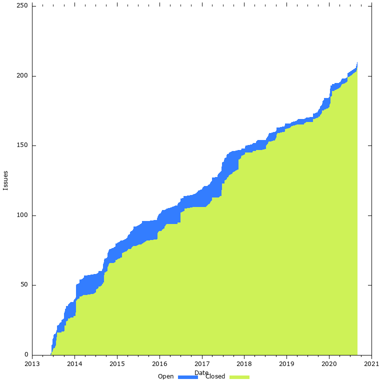
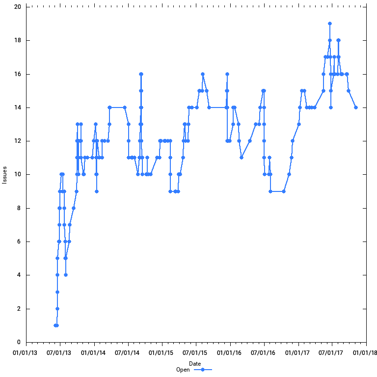
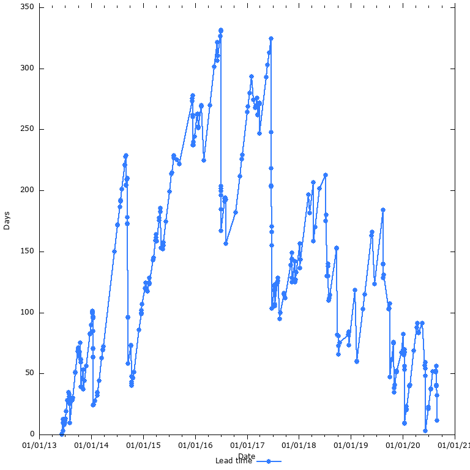
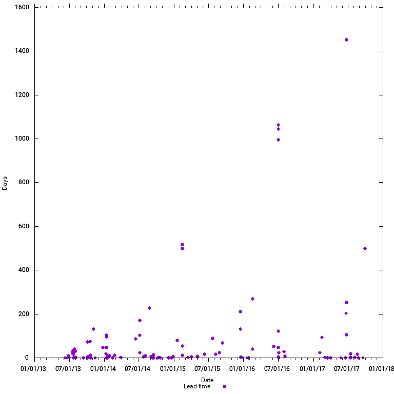

# Cucumber Issue Stats

The charts below show some GitHub issue stats for various Cucumber repos.

*21 Aug 2017*

|                   | Open Issues   | Average Lead Time (days) | Open Issues Trend |
| ----------------- | ------------- | -------------------------| ------------------|
| Cucumber-Ruby     |            97 |                      132 |             ❌    |
| Cucumber-Ruby Core|            14 |                      138 |             ✅    |
| Cucumber-JVM      |            46 |                       42 |             ✅    |
| Cucumber.js       |            20 |                       24 |             ✅    |
| Aruba             |            56 |                      212 |             ❌    |
| Cucumber-Rails    |            12 |                      184 |             ✅    |
| Cucumber Monorepo |            63 |                      116 |             ❌    |

## Cucumber-Ruby

*21 Aug 2017* - Over the past 3 years, the number of open issues have been steadily growing
from about 20 to about 90. In the past months there has been a push to close tickets,
which has brought the average lead time down from 250 to 150 days.

While many tickets have been closed, many new ones have been opened, so the number of
open tickets is still increasing.

### Cumulative Flow Diagram

### Open Issues

### Average Lead Time

### Closed Ticket Lead Time

## Cucumber-Ruby Core

### Cumulative Flow Diagram

### Open Issues

### Average Lead Time

### Closed Ticket Lead Time

## Cucumber-JVM

*6 Nov 2017*

In the past 3 months (Aug-Nov 2017) the number of open issues has been reduced
from 110 to 46. The average LT is now 42 days. This is a great improvement, mostly
due to the adoption of [stalebot](https://github.com/probot/stale).

*21 Aug 2017* - The number of open issues have been steadily growing
from since the inception of the project, until May 2017.

In the past 4 months
(May-Aug 2017) the number of open tickets has been halved from 220 to 110,
which is a tremendous effort.

During the same period, the average lead time has been reduced from 630 days to
235 days. This is still quite high, but the project is heading in the right direction.

### Cumulative Flow Diagram

### Open Issues

### Average Lead Time

### Closed Ticket Lead Time

## Cucumber.js

Cucumber.js is the best performing projects of all Cucumber projects.

The number of open issues has been steadily decreasing since 2015, and is now
at around 20, which is acceptable. The average lead time is low as well,
about 20 days.

### Cumulative Flow Diagram

### Open Issues

### Average Lead Time

### Closed Ticket Lead Time

## Aruba

### Cumulative Flow Diagram

### Open Issues

### Average Lead Time

### Closed Ticket Lead Time

## Cucumber-Rails

### Cumulative Flow Diagram

### Open Issues

### Average Lead Time

### Closed Ticket Lead Time

## Cucumber (Monorepo)

### Cumulative Flow Diagram

### Open Issues

### Average Lead Time

### Closed Ticket Lead Time

