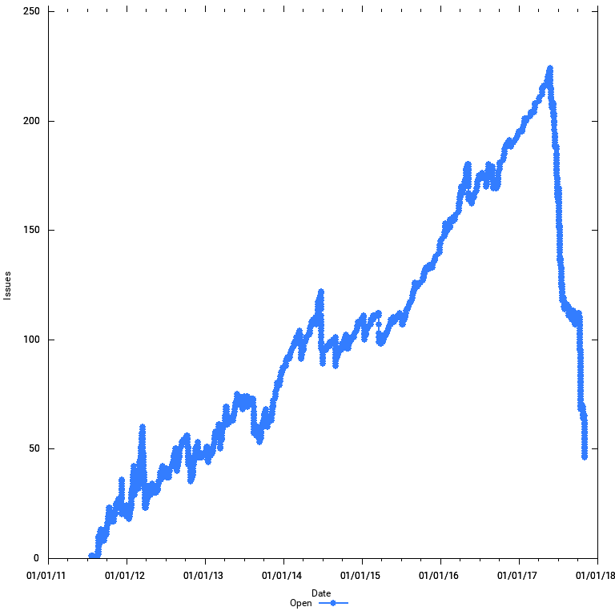
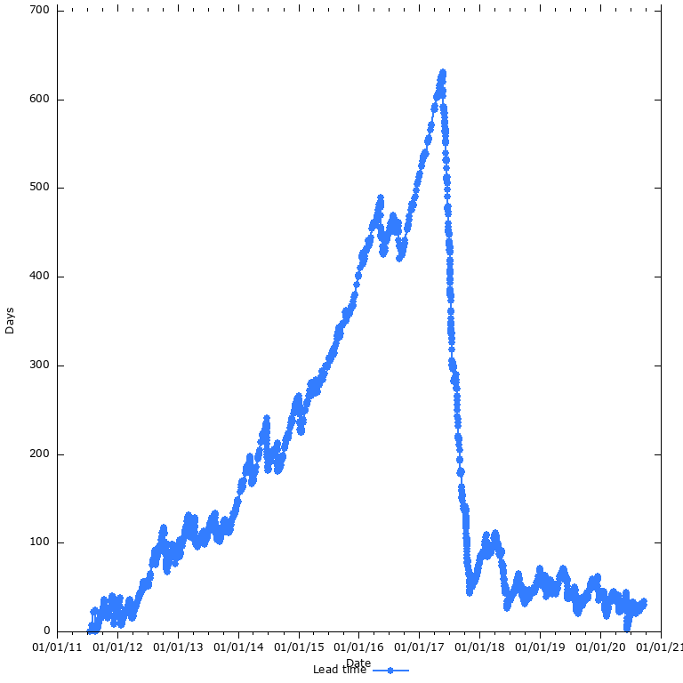
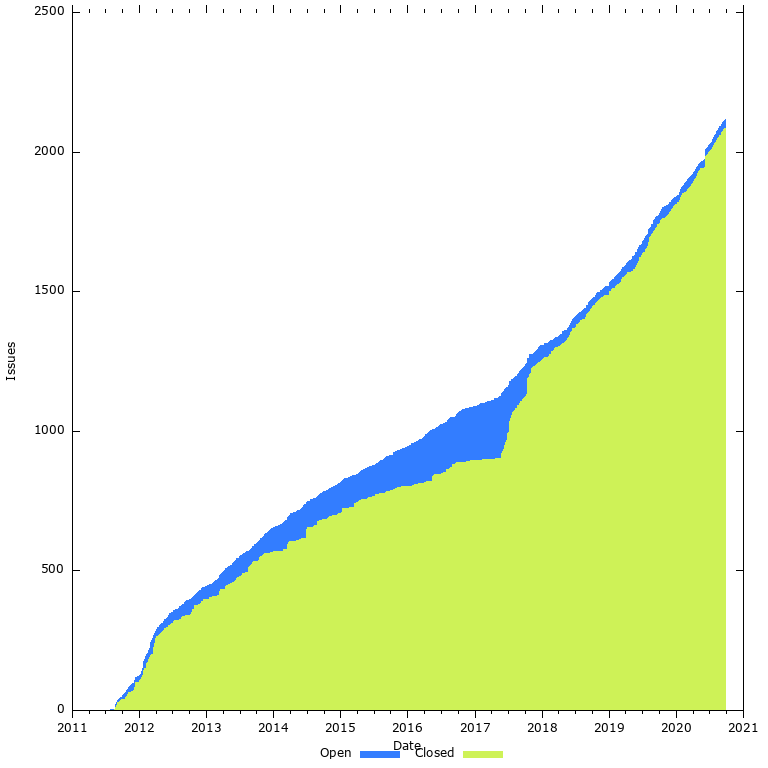

# GitHub Issue Stats (GHIS)

GHIS is a command line tool that calculates and plots stats about a GitHub project's issues:

* The number of open issues/pull requests over time
  
* Average lead time in days (time from open to closed) over time  
  
* A [Cumulative Flow Diagram](https://en.wikipedia.org/wiki/Cumulative_flow_diagram)
  

## Prerequisites

You need the following software installed

* cURL
* jq
* Ruby
* gnuplot

## Usage

First, define your GitHub credentials in `GITHUB_AUTH`. This is to avoid getting
throttled when you pull down issues with the GitHub API.

    # Username/password
    export GITHUB_AUTH='-u username:password'
    # Or, if you prefer token auth
    export GITHUB_AUTH='-H "Authorization: token TOKEN"'

Fetch a copy of GitHub issues to disk:

    scripts/fetch-issues cucumber/cucumber-jvm

Generate charts:

    make
